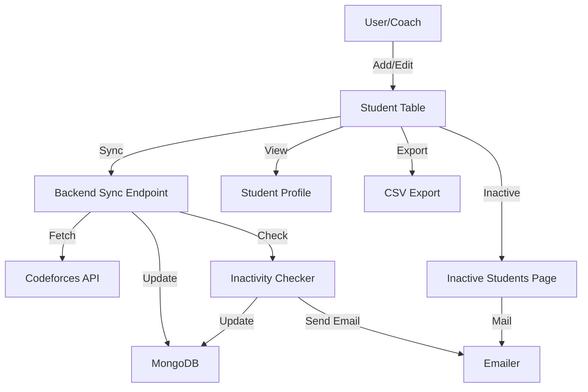

# CP Progress Management System

A full-stack web application to manage and monitor students' Codeforces progress, built with Node.js/Express/MongoDB (backend) and React/Bootstrap (frontend).

---

## 🚀 Features

- **Student Management**: Add, edit, delete, and view students with Codeforces handles and details.
- **Progress Tracking**: Sync and display Codeforces stats (rating, solved problems, etc.) for each student.
- **Inactivity Detection**: Automatically detect inactive students based on recent activity.
- **Inactivity Reminders**: Send reminder emails to inactive students (individually or in bulk).
- **Data Export**: Export student data as CSV for reporting or analysis.
- **Responsive UI**: Clean, modern, and fully responsive interface using Bootstrap.
- **Charts & Stats**: Visualize student progress with charts and tables.
- **Theme Toggle**: Switch between light and dark modes.
- **Daily Sync**: Automated daily sync with Codeforces and inactivity check (via cron job).

---

## 🖼️ Screenshots & Diagrams

### Workflow Diagram



### UI Previews

| Home (Student Table) | Student Profile (Charts) | Inactive Students |
|----------------------|-------------------------|------------------|
|  |  |  |

---

## 🏗️ Project Structure

```
CP-Progress-Management-System/
├── backend/
│   ├── controllers/         # API logic (student, export, etc.)
│   ├── cron/                # Scheduled jobs (daily sync)
│   ├── middleware/          # Error handling, etc.
│   ├── models/              # Mongoose schemas
│   ├── routes/              # Express routes
│   ├── utills/              # Utility functions (emailer, fetcher, inactivity checker)
│   ├── index.js             # App entry point
│   └── package.json         # Backend dependencies
├── frontend/
│   ├── public/              # Static files
│   ├── src/
│   │   ├── components/      # Reusable UI components
│   │   ├── pages/           # Main pages (Home, Profile, Inactive)
│   │   ├── styles/          # Custom CSS
│   │   ├── api.js           # API calls
│   │   ├── App.js           # App root
│   │   └── index.js         # Entry point
│   └── package.json         # Frontend dependencies
├── README.md
└── LICENSE
```

---

## 🔄 Typical Workflow

1. **Add Students**: Use the Home page to add new students with their Codeforces handles.
2. **Sync Progress**: Click "Sync" to fetch latest Codeforces stats for all students.
3. **View Progress**: Click a student to view their profile, stats, and charts.
4. **Detect Inactivity**: Inactive students are flagged automatically after sync or daily cron job.
5. **Send Reminders**: Go to the Inactive Students page to send reminder emails (individually or to all).
6. **Export Data**: Export the student table as CSV for reporting.

---

## ⚙️ Setup & Run

### Prerequisites
- Node.js (v16+)
- MongoDB

### Backend
```bash
cd backend
npm install
npm start
```

### Frontend
```bash
cd frontend
npm install
npm start
```

- The frontend runs on [http://localhost:3000](http://localhost:3000)
- The backend runs on [http://localhost:5000](http://localhost:5000)

---

## 📬 Email & Inactivity
- Inactivity is checked after every sync and daily via cron.
- Inactive students are listed on a dedicated page.
- Send reminder emails to one or all inactive students with a click.

---

## 📁 Docs & Credits
- See code comments and this README for details.
- Diagrams made with [Mermaid](https://mermaid-js.github.io/).
- UI screenshots are in the `docs/` folder (add your own if deploying).

---

## 📝 License
MIT License